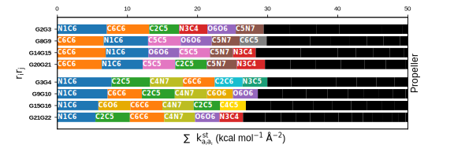

# Structure-Mechanics Statistical Learning (SMSL) for G-quadruplex DNA

[](https://www.python.org/downloads/)
[](LICENSE)

A comprehensive computational protocol for quantifying chemical-scale mechanical properties of G-quadruplex (G4) DNA structures through all-atom molecular dynamics simulations and structure-mechanics statistical learning methods.

## Table of Contents

- [Overview](#overview)
- [Key Features](#key-features)
- [System Requirements](#system-requirements)
- [Installation](#installation)
- [Project Structure](#project-structure)
- [Workflow](#workflow)
- [SMSL Python Package](#smsl-python-package)
- [Systems Studied](#systems-studied)
- [Usage Examples](#usage-examples)
- [Output and Visualization](#output-and-visualization)
- [Citation](#citation)
- [Contributing](#contributing)
- [License](#license)

## Overview

This protocol implements a complete pipeline for quantifying chemical-scale mechanical properties of G-quadruplex DNA using:

1. **All-Atom Molecular Dynamics (MD) Simulations** - Long-timescale (5 μs, 500,000 frames) simulations at 300 K
2. **Heavy-Atom Elastic Network Model (haENM)** - Coarse-grained representation using harmonic springs
3. **Fluctuation Matching** - Statistical learning optimization to derive spring constants (kij)
4. **Spectral Graph Analysis** - Laplacian eigendecomposition for mechanical hotspot identification
5. **Chemical-Scale Property Quantification** - Analysis of interaction strengths between chemical moieties

The methodology combines classical MD with structure-mechanics statistical learning to identify key structural elements responsible for G4 DNA mechanical stability at the chemical scale.

### Scientific Background

G-quadruplex DNA structures are non-canonical four-stranded nucleic acid secondary structures that frequently occur in guanine-rich sequences, such as human telomeric DNA. These structures play critical roles in:
- **Cancer Biology**: Inhibiting telomerase activity in cancer cells
- **Gene Regulation**: Modulating transcription and translation of oncogenes (c-myc, c-kit, KRAS)
- **Drug Development**: Targets for G-quadruplex stabilizers as anticancer agents

#### Key Research Questions Addressed:

1. What are the common mechanical property features across G-quadruplex topologies?
2. How do chemical moieties (base-metal coordination, base pairing, base stacking) interact mechanically?
3. What are the mechanical property differences between G-quadruplexes and duplex DNA?
4. How do different G-quadruplex topologies differ in mechanical strength?
5. How do drug molecules affect G-quadruplex mechanical properties?
6. What is the relationship between loop structures, flanking sequences, and mechanical properties?
7. How does drug binding selectivity relate to mechanical property modulation?

#### Methodological Foundation: Structure-Mechanics Statistical Learning (SMSL)

This protocol implements **Structure-Mechanics Statistical Learning (SMSL)** - a hybrid computational framework that bridges all-atom molecular dynamics with coarse-grained mechanical models to extract chemical-scale rigidity properties. The SMSL workflow consists of two key stages:

1. **Statistical Learning via Fluctuation Matching**: An iterative gradient descent optimization algorithm that parameterizes elastic network model spring constants by matching coarse-grained bond fluctuations to those observed in all-atom MD simulations, enabling quantification of chemical-scale mechanical coupling strengths.

2. **Structure-Mechanics Analysis via Spectral Graph Theory**: Eigendecomposition of the Laplacian matrix derived from the optimized spring constant network to identify mechanical hotspots and collective vibrational modes that govern structural stability.

The SMSL methodology transforms long-timescale MD trajectories into interpretable mechanical property landscapes, revealing how chemical moieties (base-metal coordination, Hoogsteen base pairing, π-π stacking, backbone interactions) collectively determine G-quadruplex mechanical behavior.

## Key Features

- ✅ **Automated Pipeline**: End-to-end workflow from PDB structure to chemical-scale mechanical property analysis
- 📊 **Multi-Topology Analysis**: 14 systems total (13 G-quadruplexes + 1 dsDNA control) covering 5 G-quadruplex topologies (Propeller, Basket, Chair, Hybrid-I, Hybrid-II)
- 🔬 **High-Performance Computing**: Optimized for HPC clusters with GPU-accelerated MD (GROMACS 2024.2)
- 📈 **Rich Visualization**: Eigenvalue spectra, participation ratios, mechanical hotspots, and correlation plots
- 🧬 **Drug-Binding Complexes**: G-quadruplex stabilizers (TMPyP4/POH, Epiberberine/EWV) with GAFF force fields
- 🎯 **Chemical-Scale Resolution**: Quantifies interaction strengths between base-metal coordination, Hoogsteen base pairing, π-π stacking, and backbone interactions
- 🔄 **Reproducible Research**: Configuration-driven workflow with complete parameter tracking and multi-window averaging (19 × 500 ns windows)

## System Requirements

### Software Dependencies

- **Python**: 3.11.11
- **CHARMM**: c43b1 or higher (for molecular modeling)
- **GROMACS**: 2024.2 (included in conda environment, for MD simulation)
- **AmberTools**: 23.3 (included in conda environment, for generating drug force field)
- **PyMOL**: 2.5 (included in conda environment, for molecular modeling)

### Python Packages

The complete environment is defined in `smsl/environment.yml`:

```yaml
Core Dependencies:
- GROMACS 2024.2          # MD simulation engine
- MDAnalysis 2.9.0        # Trajectory analysis
- AmberTools 23.3         # Drug force field parameterization
- PyMOL 2.5               # Structure visualization
- NumPy 1.26.4            # Numerical computing
- pandas 2.2.3            # Data manipulation
- matplotlib 3.10.1       # Plotting
- seaborn 0.13.2          # Statistical visualization
- scipy 1.15.2            # Scientific computing
- tqdm 4.67.1             # Progress bars
- psutil 7.0.0            # System monitoring
```

All dependencies can be installed via conda/mamba using `smsl/environment.yml`.

### Hardware Requirements

- **Minimum**: 32 GB RAM, 8 CPU cores, 1 GPU (for MD simulations)
- **Recommended**: 128+ GB RAM, 20+ CPU cores, 2+ GPUs
- **Storage**: ~2.5 TB (including trajectories)

## Installation

### 1. Clone Repository

```bash
git clone https://github.com/HsuShihHsueh/smsl_g4dna.git
cd smsl_g4dna
```

### 2. Set Up Python Environment

```bash
# Use mamba for faster installation (recommended)
mamba env create -f smsl/environment.yml

# Activate environment
mamba activate smsl
```

**Note**: The environment includes GROMACS 2024.2 and AmberTools 23.3. If you prefer to use system-installed versions, you can remove them from `smsl/environment.yml` before creating the environment.

### 3. Configure Paths

Edit paths in system configuration files (e.g., `propeller/d.fluctmatch/propeller.conf`):

```properties
bigtraj_folder  = ./bigtraj_fluctmatch
scratchroot     = /path/to/scratch/space
```

### 4. Install CHARMM (External)

CHARMM is not available via conda. Install separately and place in:
- **CHARMM executable**: `smsl/opt/c43b1/bin/charmm`
- **CHARMM toppar**: `smsl/opt/c43b1/toppar/`

Or download from: https://www.charmm-gui.org/charmmdoc/install.html

## Project Structure

```
smsl_g4dna/
├── README.md                          # This file
├── smsl/                              # Structure-Mechanics Statistical Learning package
│   ├── smsl/                          # Core Python modules
│   │   ├── config.py                  # Configuration management
│   │   ├── trajTransfer.py            # MD trajectory processing
│   │   ├── enmBuilder.py              # Elastic network model construction
│   │   ├── fluctMatch.py              # Fluctuation matching algorithm
│   │   ├── makeDataframe.py           # Spring constant data organization
│   │   ├── category.py                # Atom pair categorization
│   │   ├── pairtype.py                # Pair type definitions
│   │   ├── graph.py                   # Spectral graph analysis
│   │   ├── graphBigtraj.py            # Multi-window analysis
│   │   ├── plotAgent.py               # Visualization utilities
│   │   └── multiWindows.py            # Time window management
│   ├── opt/                           # External software and force fields
│   │   ├── c43b1/                     # CHARMM installation
│   │   ├── force_field/               # AMBER/CHARMM force fields
│   │   └── mdp/                       # GROMACS parameter files
│   └── *.yml                          # Conda environment files
│
├── propeller/                         # Example system (Propeller topology)
│   ├── a.charmm.dna_setup/           # Step A: Initial structure preparation
│   │   └── 1_charmm_setup.ipynb
│   ├── c.gromacs.run_md/             # Step C: MD simulations
│   │   ├── 1.create_system/          # System setup and equilibration
│   │   ├── 2.simulation/             # Production MD
│   │   └── 3.trajectory_data/        # Processed trajectories
│   └── d.fluctmatch/                 # Step D: Mechanical analysis
│       ├── 1_trajectory_tranfer.ipynb       # Convert to CHARMM format
│       ├── 2_build_enm_model.ipynb          # Build haENM topology
│       ├── 3_fluctuation_matching.ipynb     # Optimize spring constants
│       ├── 4.0_make_k_b0_df_bigtraj.ipynb  # Generate dataframes
│       ├── 4.1_check_k_of_all_data.ipynb   # Quality control
│       ├── 5.11_graph_bm.ipynb              # Base-metal analysis
│       ├── 5.12_graph_hb.ipynb              # Hydrogen bond analysis
│       ├── 5.21_graph_st_top.ipynb          # Stacking (top) analysis
│       ├── 5.31_graph_rb.ipynb              # Ribose-base analysis
│       ├── 5.32_graph_pr0.ipynb             # Phosphate-ribose analysis
│       ├── propeller.conf                   # System configuration
│       └── bigtraj_fluctmatch/             # Results by time window
│
├── [13 other systems]/               # Same structure as propeller
│   ├── basket/, basket_na/
│   ├── chair/
│   ├── hybrid-i/, hybrid-ii/
│   ├── hybrid-ii_wttel26/
│   ├── propeller_ewv/, propeller_poh/
│   ├── hybrid-ii_ewv/, hybrid-ii_poh/
│   ├── hybrid-ii_wttel26_ewv/, hybrid-ii_wttel26_poh/
│   └── dsdna/
│
└── summary/                          # Cross-system comparative analysis
    └── d.fluctmatch/
        ├── fig5.*.ipynb              # Main text figures
        ├── figA.*.ipynb              # Appendix figures
        ├── tab5.*.ipynb              # Tables
        ├── summary.conf              # Summary configuration
        └── data/                     # Aggregated data (JSON/CSV)
```

## Workflow

### Complete Pipeline Overview

```
[PDB Structure] 
    ↓
(A) DNA Setup → [CHARMM .psf/.pdb]
    ↓
(B) Drug FF (optional) → [AMBER .itp/.gro]
    ↓
(C) MD Simulation → [Trajectory .xtc, 5μs]
    ↓
(D) Fluctuation Matching → [Spring Constants kij]
    ↓
(E) Mechanical Analysis → [Figures & Tables]
```

### Detailed Workflow

#### **Step A: G-Quadruplex Structure Modeling**

**Input**: Experimental structure from PDB (e.g., 1KF1 for Propeller)  
**Output**: CHARMM-format topology (.rtf, .psf) and coordinates (.pdb, .crd)  
**Location**: `{system}/a.charmm.dna_setup/`

**Structural Modifications**:
1. **Download & Preprocess**: 
   - Download PDB structure
   - Remove crystallization waters (X-ray structures)
   - Remove extra K+ ions at dimer interfaces (if present)
   
2. **Format Conversion**:
   - Convert RCSB atom naming → CHARMM format
   - Sequence modification to wtTel22 (d[AGGG(TTAGGG)₃]) if needed
   
3. **Ion Placement** (for NMR structures):
   - Calculate coordination center positions from O6 atoms
   - Place K+ ions at tetrad-tetrad interfaces
   
4. **Topology Generation with CHARMM36**:
   - Add 5TER and 3TER terminal patches
   - Apply DEOX patches to convert RNA→DNA
   - Generate hydrogen atoms via internal coordinate (IC) manipulation
   
5. **Energy Minimization** (3-stage):
   - Stage 1: Steepest Descent (SD), 100 steps
   - Stage 2: Adopted Basis Newton-Raphson (ABNR), 1000 steps
   - Stage 3: ABNR, 5000 steps with positional restraints on initialized atoms

**Systems Built**:
- **System 1-5**: Five G-quadruplex topologies (Propeller, Basket, Chair, Hybrid-I, Hybrid-II)
- **System 6**: Duplex DNA (dsDNA) as control (B-form double helix)
- **System 7**: Basket-Na+ (Na+ coordination)
- **System 8-12**: Propeller-POH, Propeller-EWV, Hybrid-II-wtTel26-EWV, Hybrid-II-wtTel-POH (G-quadruplex binding with drug)
- **System x(not use in result)**: Hybrid-II-wtTel26 (extended flanking sequence), Hybrid-II-ewv, Hybrid-II-poh

**Key Notebook**: `1_charmm_setup.ipynb`

```python
# Example: Setup Propeller topology G-quadruplex
pdbid = "1kf1"  # X-ray structure with K+ ions
sequence = "AGGGTTAGGGTTAGGGTTAGGG"  # wtTel22

# Download and preprocess
!wget https://files.rcsb.org/download/{pdbid.upper()}.pdb
!pymol -c preprocess.pml  # Remove waters, retain K+ ions

# CHARMM topology generation
# - Apply DEOX patches for DNA
# - Generate hydrogens via IC BUILD
# - Energy minimize with SD + ABNR
```

#### **Step B: Small Molecule Drug Force Field Parameterization** (Optional)

**Input**: Drug SDF file or SMILES (TMPyP4/POH, Epiberberine/EWV)  
**Output**: GAFF-compatible topology (.itp) and coordinates (.gro)  
**Location**: `{g4dna}_ewv/b.amber.drug_ff/` or `{g4dna}_poh/b.amber.drug_ff/`

**GAFF Parameterization Workflow**:

1. **Structure Optimization**:
   - Gaussian 16: B3LYP/6-31G* geometry optimization
   - Generate molecular orbital information
   
2. **Charge Calculation**:
   - Compute electrostatic potential surface (ESP)
   - RESP charge fitting via AmberTools antechamber
   - Special handling for formal charges (e.g., N-methyl-4-pyrrolinium in POH: +1e)
   
3. **Atom Type Assignment**:
   - Use PARM94/99/99SB naming (not GAFF default)
   - Ensures consistent aromatic bond types in symmetric molecules
   - Avoids incorrect cc/ce-cd/cf single/double bond assignments
   
4. **Force Field Parameter Generation**:
   - parmchk: Generate missing intramolecular interaction parameters
   - Use GAFF (Generalized Amber Force Field) as base
   - Manual refinement for special cases:
     - **POH**: Transfer pyrrole parameters from Calix[4]pyrrole
     - **POH**: Refit dihedral angles (pyrrole-N-methyl-4-pyrrolinium) using mdgx
       - Scan dihedral 0° to 359° (1° intervals)
       - Single-point energy: MP2/cc-pVTZ level (ORCA)
       - Fit to reproduce ±62° to ±65° minimum
   
5. **Structure Alignment**:
   - Align drug to experimental complex structure (PyMOL)
   - Position drug at G-quadruplex tetrad interfaces
   - Energy minimize with frozen core region (5000 steps SD)
   
6. **Format Conversion**:
   - leap: Generate Amber coordinate (.crd) and parameter (.prmtop) files
   - acpype: Convert to GROMACS format (.gro, .itp, .top)

**Drug Molecules**:
- **TMPyP4 (POH)**: Porphyrin derivative, 4 × N-methyl-4-pyrrolinium groups, +4e formal charge
  - End-pasting mechanism: Stacks on tetrads
  - PDB examples: 2HRI (Propeller), 6CCW (Hybrid-II)
  
- **Epiberberine (EWV)**: Isoquinoline alkaloid from berberine derivatives
  - Intercalates between flanking sequences and top tetrad
  - Higher selectivity for human telomeric G-quadruplexes vs dsDNA

**Systems with drugs**: 
- System 9-12: POH/EWV bound to Propeller/Hybrid-II topologies
- Drug-swapped systems for selectivity studies

#### **Step C: All-Atom Molecular Dynamics Simulations**

**Input**: CHARMM/AMBER structure  
**Output**: 5 μs trajectory (500,000 frames at 10 ps interval)  
**Location**: `{system}/c.gromacs.run_md/`

##### C.1: System Creation

**Notebook**: `1.create_system/1.1_create_system.ipynb`

**Solvation & Ionization**:
```bash
# Convert to GROMACS format (AMBER14SB-PARMBSC1 force field)
gmx pdb2gmx -f structure.pdb -ff amber14sb_parmbsc1 -water tip3p

# Add dodecahedral box (~12 Å from solute)
# Fine-tuned to achieve ~12,200 total atoms (~6% solute)
gmx editconf -f structure.gro -d 0.728964 -bt dodecahedron

# Solvate with TIP3P water
gmx solvate -cp boxed.gro -cs spc216.gro -o solvated.gro

# Add ions: 0.15 M concentration (physiological)
# K+/Cl- for most systems, Na+/Cl- for System 7
# Neutralize system charge (-22e from phosphate backbone)
gmx genion -s ions.tpr -o system.gro -pname K -nname CL -neutral -conc 0.15
```

**Ion Counts**:
- Cl⁻: 9-10 (depending on box size)
- K⁺: 25-29 (varies by system: DNA charge + drug charge + neutralization)

##### C.2: Energy Minimization & Equilibration

**Script**: `1.create_system/1.3_equilibrium.slurm`

**Stage 1: Energy Minimization** (2 phases)
- Phase 1: SD, 5000 steps or F_max < 1000 kJ/mol/nm
- Phase 2: SD, 50000 steps or F_max < 100 kJ/mol/nm
- Positional restraints: 1000 kJ/mol/nm² on heavy atoms

**Stage 2: Heating** (1 ns, NVT)
- 0 → 300 K with Langevin thermostat
- Position restraints maintained

**Stage 3: Pressure Equilibration** (6 ns total, NPT)
- NPT1 (4 ns): 1000 kJ/mol/nm² restraints
- NPT2 (2 ns): No restraints, system fully relaxed
- Parrinello-Rahman barostat → 1 atm
- Langevin thermostat → 300 K

##### C.3: Production MD

**Script**: `2.simulation/2.2_simulation.slurm`

**Parameters**:
- **Duration**: 5000 ns (5 μs)
- **Time Step**: 2 fs (with LINCS constraints on H-bonds)
- **Temperature**: 300 K (Langevin thermostat, τ = 1.0 ps)
- **Pressure**: 1 bar (Parrinello-Rahman barostat, τ = 5.0 ps)
- **Cutoffs**: 
  - Coulomb: 1.0 nm (PME for long-range)
  - van der Waals: 1.0 nm
- **Output**: Save coordinates every 10 ps → 500,000 frames
- **Periodic Boundary Conditions**: Applied throughout

**Computational Resources**:
- GPU acceleration: 2 × GPUs (CUDA)
- CPU threads: 20 cores (4 × MPI tasks, 6 × OpenMP threads each)
- Walltime: ~100-200 GPU hours per system
- Total storage: ~500 GB per system (trajectory + analysis)

##### C.4: Trajectory Post-Processing

**Notebook**: `2.simulation/2.3_trajectory_processing.ipynb`

```bash
# Remove periodic boundary conditions
echo "0" | gmx trjconv -s md.tpr -f md.xtc -o md_nopbc.xtc \
  -pbc res -ur compact

# Downsample: 10 ps → 1 ns (500,000 → 5,000 frames)
gmx trjconv -f md_nopbc.xtc -o final_5us5kf.xtc -dt 1000

# Generate portable trajectory for analysis
# Final output: system_5us5kf.xtc (used in fluctuation matching)
```

**Quality Control**:
- RMSD monitoring: Convergence check (< 3 Å for core region)
- Temperature/Pressure stability
- Ion coordination: Verify K+ remains in binding sites
- Visual inspection: PyMOL trajectory movies

#### **Step D: Fluctuation Matching & Mechanical Property Analysis**

**Input**: All-atom MD trajectory (5 μs, 500,000 frames)  
**Output**: Chemical-scale spring constants {k_ij}  
**Location**: `{system}/d.fluctmatch/`

##### D.1: Trajectory Transfer to Coarse-Grained Representation

**Notebook**: `1_trajectory_tranfer.ipynb`

**Coarse-Graining Strategy**:
```python
# Remove hydrogen atoms: 717 atoms → ~400 heavy atoms
# Segment atoms by chemical role:
seg_select = {
    'STRAND1': 'nucleic',           # DNA heavy atoms
    'STRAND2': 'element K or Na',   # Metal ions
    'STRAND3': 'not nucleic and not (element K or Na)'  # Drug/solvent
}
```

**Format Conversion**:
- GROMACS .xtc → CHARMM .dcd (via MDAnalysis)
- GROMACS .gro → CHARMM .crd (coordinate file)
- Preserve segid information for downstream analysis
- Output: 5000 frames (1 ns interval) for each time window

##### D.2: Build Heavy-Atom Elastic Network Model (haENM)

**Notebook**: `2_build_enm_model.ipynb`

**Algorithm**: Contact-based topology generation

1. **Cutoff Distance**: R_c = 5.0 Å (optimized for G-quadruplex flexibility)
   
2. **Multi-Window Contact Union**:
   - Split 5 μs into 19 overlapping windows (500 ns each)
   - Window structure: [0-500ns], [250-750ns], [500-1000ns], ..., [4500-5000ns]
   - For each window: Identify all atom pairs with l_ij^0 < 5.0 Å (first frame)
   - Union of contacts → haENM topology (ensures consistent network)
   
3. **CHARMM Topology Files**:
   - `.rtf`: Residue topology (MASS, ATOM, BOND declarations)
   - `.str`: Internal coordinate constraints (IC EDIT...DIST commands)
   - `.psf`: Protein structure file (bond connectivity)
   - Example ENM naming: A1, A2, ..., B1, B2, ... (chain letter + atom index)

**Mathematical Foundation**:

The haENM potential energy function:

$$U_{\text{haENM}} = \frac{1}{2} \sum_{i<j} k_{ij} (l_{ij} - l_{ij}^0)^2$$

where:
- $k_{ij}$: Spring constant (kcal/mol/Ų) to be optimized
- $l_{ij}$: Instantaneous bond length
- $l_{ij}^0$: Equilibrium bond length (time-averaged from MD)
- Summation over all atom pairs with $l_{ij}^0 < R_c$

**Typical ENM Size**:
- Atoms (beads): ~400-500 heavy atoms
- Bonds (springs): ~15,000-25,000 atom pairs
- Degrees of freedom: 3N - 6 vibrational modes

##### D.3: Fluctuation Matching Optimization

**Notebook**: `3_fluctuation_matching.ipynb`

**Algorithm**: Iterative gradient descent with fluctuation matching

**Theoretical Basis**:
```
The haENM vibrational partition function provides bond fluctuations:
⟨δl²ᵢⱼ⟩_NMA from Normal Mode Analysis (NMA)

These must match MD-observed fluctuations:
⟨δl²ᵢⱼ⟩_AA from All-Atom trajectory sampling
```

**Optimization Procedure** (per time window):

**Step 1: Initialize Spring Constants**
```
k_ij^(0) = RT / ⟨δl²ᵢⱼ⟩_AA²

where:
- R = 1.9872 × 10⁻³ kcal/(mol·K) (gas constant)
- T = 300 K
- RT = 0.5922 kcal/mol
```

**Step 2: Iterative Update** (n = 1 to 250)
```
For iteration n:
  a. Run CHARMM Normal Mode Analysis (NMA)
     - Minimize energy with current k_ij^(n)
     - Diagonalize Hessian matrix → frequencies, eigenvectors
     - Calculate ⟨δl²ᵢⱼ⟩_NMA^(n) from eigenmodes
  
  b. Compute gradient of loss function:
     ∇L = (1/⟨δl²ᵢⱼ⟩_NMA)² - (1/⟨δl²ᵢⱼ⟩_AA)²
  
  c. Update spring constants (gradient descent):
     k_ij^(n+1) = k_ij^(n) - α · ∇L
     
     where α = 0.02 (learning rate)
  
  d. Enforce physical constraint:
     if k_ij^(n+1) < 0: set k_ij^(n+1) = 0
     (negative spring constants are non-physical)
  
  e. Monitor convergence:
     RMSD_error = √[mean((⟨δl²ᵢⱼ⟩_AA - ⟨δl²ᵢⱼ⟩_NMA)²)]
```

**Step 3: Convergence**
- Typical convergence: 150-250 iterations
- Final parameters: k_ij^(250) saved to `.prm` file
- Iteration history: Saved to `error_5.00.txt` and `k_fluct_iter_5.00.csv`

**Parallelization**:
```python
# Multi-window parallel execution (ThreadPoolExecutor)
with ThreadPoolExecutor(max_workers=10) as executor:
    for time_label, st_agent in t_agent.items():
        executor.submit(st_agent.fluct_match)
```

**CHARMM NMA Execution**:
```fortran
! Simplified CHARMM script for NMA
READ RTF CARD UNIT 11 ! Topology
READ PARA CARD UNIT 12 ! Current k_ij parameters
READ COOR CARD UNIT 13 ! ENM coordinates

MINI SD NSTEP 100      ! Energy minimization
MINI ABNR NSTEP 45000

VIBRAN NMODE 3N        ! Normal mode analysis
  DIAG FINI            ! Diagonalize Hessian
  FLUC IC TEMP 300.0   ! Calculate IC fluctuations
END
```

**Physical Interpretation**:
- High $k_{ij}$ → Strong mechanical coupling (rigid constraint)
- Low $k_{ij}$ → Weak coupling (flexible hinge)
- $k_{ij}$ = 0 → No mechanical interaction (beyond correlation)

**Convergence Monitoring**:
- Initial error spike (iteration 1): ~0.5-1.0 Å
- Plateau (iteration 250): ~0.05-0.15 Å
- Indicates successful matching of coarse-grained to all-atom dynamics

##### D.4: Generate Data Matrices

**Notebook**: `4.0_make_k_b0_df_bigtraj.ipynb`

Organize spring constants into structured DataFrames:

```python
DataFrame columns:
- PairID: Unique identifier
- Strand_i/j: DNA strand or ion/drug
- Resid_i/j: Residue number
- Atomname_i/j: Atom identifier
- Atomid_i/j: Global atom index
- k: Spring constant (kcal/mol/Ų)
- b0: Equilibrium distance (Å)
- Category: Interaction type (BM, HB, ST, RB, PR, etc.)
```

**Categorization**:
- **BM**: Base-Metal coordination
- **HB**: Hydrogen bonding (Hoogsteen)
- **ST**: π-π Stacking
- **RB**: Ribose-Base
- **PR**: Phosphate-Ribose (backbone)
- **CL_ST**: Cross-layer stacking

##### D.5: Spectral Graph Analysis

**Notebooks**: `5.*.ipynb`

**Method**: Eigendecomposition of Laplacian matrix

1. **Construct Graph**:
   - Nodes: Atoms (beads)
   - Edges: Springs with weights kij
   
2. **Build Laplacian Matrix**:
   $$L = D - A$$
   where D is degree matrix, A is weighted adjacency matrix

3. **Eigendecomposition**:
   $$L \mathbf{v}_\alpha = \lambda_\alpha \mathbf{v}_\alpha$$
   
4. **Identify Mechanical Modes**:
   - λα: Eigenvalue (stiffness of mode α)
   - vα: Eigenvector (participation of each atom)
   - Prominent modes: High λ AND high participation ratio

5. **Hotspot Detection**:
   - Calculate eigenvector product: vα,i × vα,j
   - Identify atom pairs with |vα,i × vα,j| > threshold
   - Filter by: |$λ_αv_{α,i}v_{α,j}$ - $k_{ij}$| / $k_{ij}$ < 50%

**Key Metrics**:
- **Eigenvalue ($λ_α$)**: Modal stiffness
- **Participation Ratio ($r_α$)**: Mode delocalization
- **Eigenvector-Eigenvector Product**: Hotspot identification

#### **Step E: Summary Analysis**

**Location**: `summary/d.fluctmatch/`

Cross-system comparative analysis:

1. **Aggregate Data**: Collect kij from all 14 systems
2. **Statistical Analysis**: 
   - Mean and standard deviation of spring constants
   - Correlation analysis between mechanical properties
   - Hotspot frequency across systems
3. **Generate Figures**: Publication-ready plots
4. **Export Tables**: CSV/JSON for downstream analysis

**Key Outputs**:
- `data/bm_avg.csv`: Average base-metal spring constants
- `data/hb.json`: Hydrogen bond mechanical properties
- Figure notebooks: `fig5.*.ipynb`, `figA.*.ipynb`

## SMSL Python Package

The **Structure-Mechanics Statistical Learning (SMSL)** package provides the core functionality.

### Module Overview

#### Core Modules

**`config.py`**: Configuration management
- Parses `.conf` files
- Manages system parameters (sequence, ions, topology)
- Defines `ConfAgent` base class

**`multiWindows.py`**: Time window management
- `TimeAgent`: Manages multiple trajectory windows
- `SmallTimeAgent`: Individual window operations
- Splits 5 μs trajectory into overlapping windows

**`trajTransfer.py`**: Trajectory processing
- `MDAgent`: Converts GROMACS → CHARMM format
- Removes hydrogens
- Segments by atom type

**`enmBuilder.py`**: Elastic network construction
- `ENMAgent`: Builds haENM topology
- Cutoff-based contact detection
- CHARMM file generation (.rtf, .str, .psf)

**`fluctMatch.py`**: Optimization algorithm
- `FmAgent`: Orchestrates fluctuation matching
- Iterative k optimization
- CHARMM NMA execution
- Convergence monitoring

**`makeDataframe.py`**: Data organization
- `SpringAgent`: Organizes spring constants
- Category assignment
- Multi-window averaging

#### Analysis Modules

**`category.py`**: Atom pair classification
- Detects bond types (BM, HB, ST, RB, PR)
- G4-specific and dsDNA categorization
- CHARMM topology parsing

**`pairtype.py`**: Interaction definitions
- Atom type mappings
- Hydrogen bond definitions
- Base pairing rules

**`graph.py`**: Spectral analysis
- `GraphAgent`: Single-window analysis
- Eigendecomposition
- Hotspot identification
- Mode visualization

**`graphBigtraj.py`**: Multi-window analysis
- `BigTrajGraphAgent`: Aggregate spectral properties
- Prominent mode detection
- Cross-window averaging

**`plotAgent.py`**: Visualization
- `PlotAgent`: Publication-quality figures
- Heatmaps, scatter plots, stackplots
- Style management

### Configuration File Format

Example: `propeller/d.fluctmatch/propeller.conf`

```properties
# Paths
bigtraj_folder  = ./bigtraj_fluctmatch
scratchroot     = /scratch/user/fluctmatch

# System parameters
type_na         = g4dna
na              = propeller
drug            = 
n_bp            = 22
sequence        = AGGGTTAGGGTTAGGGTTAGGG

# G4 topology (residue indices of tetrads)
quadruplex_layers = [\
  2  8 14 20\
  3  9 15 21\
  4 10 16 22\
]

# Glycosidic bond angles (A=anti, S=syn)
GBAc            = AAAAAAAAAAAAAAAAAAAAAA

# haENM parameters
cutoff          = 5.0    # Angstrom
frame_num       = 500000 # Total frames
time_num        = 5000   # Microseconds
split_num       = 19     # Number of windows

# Optimization parameters
T               = 300.0  # Kelvin
lr              = 0.02   # Learning rate
iter_num        = 250    # Iterations
```

## Systems Studied

This protocol analyzes **14 molecular systems**: **13 G-quadruplex structures** + **1 dsDNA control**, spanning **5 distinct topologies**.

### Core G-Quadruplex Topologies (8 systems)

| System # | Directory Name | PDB ID | Topology | Loop Types | Sequence | Ion | Description |
|----------|---------------|--------|----------|------------|----------|-----|-------------|
| 1 | propeller | 1KF1 | All-parallel | -p-p-p | wtTel22 | K⁺ | Propeller loops, all strands parallel (⊗⊗⊗⊗) |
| 2 | basket | 143D | Antiparallel (2+2) | -ld+l | wtTel22 | K⁺ | Basket form, diagonal + lateral loops |
| 3 | chair | 6JKN | Antiparallel (2+2) | -l-l-l | wtTel21 | K⁺ | Chair form with pseudo-tetrad |
| 4 | hybrid-i | 2JSM | Hybrid (3+1) Form-1 | -p-l-l | wtTel23 | K⁺ | Propeller at 5' end |
| 5 | hybrid-ii | 2JPZ | Hybrid (3+1) Form-2 | -l-l-p | wtTel22 | K⁺ | Propeller at 3' end |
| 6 | dsdna | NAB-generated | B-form duplex | N/A | wtTel22 | N/A | Control: Watson-Crick base pairing |
| 7 | basket_na | 143D | Antiparallel (2+2) | d+2l | wtTel22 | Na⁺ | Ion effect: Na⁺ vs K⁺ coordination |
| 8 | hybrid-ii_wttel26 | 2JPZ | Hybrid (3+1) Form-2 | 2d+p | wtTel26 | K⁺ | Flanking effect: A1+TTA25+T26 |

**Loop Type Notation**:
- **p**: Propeller loop (parallel strands)
- **l**: Lateral loop (antiparallel, side-by-side)
- **d**: Diagonal loop (antiparallel, opposite corners)

**Sequence Definitions**:
- **wtTel22**: d[AGGG(TTAGGG)₃] (wild-type human telomere, 22 nt)
- **wtTel23**: d[TAGGG(TTAGGG)₃] (23 nt, 5' thymine)
- **wtTel26**: d[AGGG(TTAGGG)₃TTA] (26 nt, 3' flanking TTA)
- **wtTel21**: d[GGG(TTAGGG)₃] (21 nt, minimal core)

### Drug-Bound Complexes (4 systems)

| System # | Directory Name | Base Topology | Drug | Chemical ID | Mechanism | Description |
|----------|---------------|---------------|------|-------------|-----------|-------------|
| 9 | propeller_poh | Propeller | TMPyP4 | POH | End-pasting | Native complex (PDB: 2HRI) |
| 10 | propeller_ewv | Propeller | Epiberberine | EWV | End-pasting | Drug-swapped from Hybrid-II-EWV |
| 11 | hybrid-ii_wttel26_ewv | Hybrid-II (Tel26) | Epiberberine | EWV | End-pasting | Native complex (PDB: 6CCW) |
| 12 | hybrid-ii_wttel26_poh | Hybrid-II (Tel26) | TMPyP4 | POH | End-pasting | Drug-swapped from Propeller-POH |

**Drug Molecules**:
- **TMPyP4 (POH)**: 5,10,15,20-tetrakis-(N-methyl-4-pyridyl)porphine
  - Macrocycle with +4e charge
  - Stacks on tetrad planes via π-π interactions
  - Low selectivity (binds multiple G4 topologies + dsDNA)
  
- **Epiberberine (EWV)**: Isoquinoline alkaloid
  - PAH derivative from berberine family
  - Intercalates between T2:T13:A15 triplet and top tetrad
  - High selectivity for human telomeric G-quadruplexes
  - Can convert Basket/Hybrid-I → Hybrid-II topology

### Recommended Processing Order

```
# Core systems first
a. propeller, basket, chair, hybrid-i, hybrid-ii, dsdna

# Extended systems
b. propeller_poh, hybrid-ii_wttel26_ewv

# Drug systems (depend on #2)
c. propeller_ewv (needs hybrid-ii_wttel26_ewv)
d. hybrid-ii_wttel26_poh (needs propeller_poh)
e. hybrid-ii_ewv (needs hybrid-ii_wttel26_ewv)
f. hybrid-ii_poh (needs hybrid-ii_wttel26_poh)
```

## Usage Examples

### Example 1: Run Complete Pipeline for New System

```bash
# 1. Set up directory structure
cd new_system
mkdir -p a.charmm.dna_setup c.gromacs.run_md d.fluctmatch

# 2. DNA setup
cd a.charmm.dna_setup
jupyter notebook 1_charmm_setup.ipynb
# Edit PDB ID and run all cells

# 3. MD simulation
cd ../c.gromacs.run_md/1.create_system
jupyter notebook 1.1_create_system.ipynb
# Submit equilibration job
sbatch 1.3_equilibrium.slurm

# Wait for equilibration to complete...

cd ../2.simulation
jupyter notebook 2.1_simulation_generator.ipynb
sbatch 2.2_simulation.slurm

# Wait for production MD (several days)...

# 4. Process trajectory
jupyter notebook 2.3_trajectory_processing.ipynb

# 5. Fluctuation matching
cd ../../d.fluctmatch
cp ../../propeller/d.fluctmatch/propeller.conf ./new_system.conf
# Edit configuration file

jupyter notebook 1_trajectory_tranfer.ipynb
jupyter notebook 2_build_enm_model.ipynb
jupyter notebook 3_fluctuation_matching.ipynb

# 6. Analysis
jupyter notebook 4.0_make_k_b0_df_bigtraj.ipynb
jupyter notebook 5.11_graph_bm.ipynb
```

### Example 2: Analyze Existing Data

```python
import sys
sys.path.append("../../smsl")
from smsl.graphBigtraj import BigTrajGraphAgent
from smsl.graph import BM

# Load data
b_agent = BigTrajGraphAgent(BM)
b_agent.spectral_decomposition()

# Analyze prominent modes
b_agent.set_mean_r_alpha_array()
b_agent.plot_prominent_modes_and_identify_atom_with_interactive()

# Get hotspots
b_agent.t_agent.mean.get_modes_info(
    n_mode=45, 
    vlv_threshold=0.05, 
    pe_threshold=0.5
)
```

### Example 3: Cross-System Comparison

```python
import sys
sys.path.append("../../smsl")
from smsl.plotAgent import PlotAgent
import pandas as pd

# Load aggregated data
df_bm = pd.read_csv('summary/d.fluctmatch/data/bm_avg.csv', index_col=[0,1,2])
df_hb = pd.read_csv('summary/d.fluctmatch/data/hb_avg.csv', index_col=[0,1])

# Plot correlation
import seaborn as sns
import matplotlib.pyplot as plt

plt.figure(figsize=(8,6))
sns.scatterplot(data=df_bm, x='Q3', y='Q2', hue='system')
plt.xlabel('K1-Q3 Spring Constant (kcal/mol/Ų)')
plt.ylabel('K1-Q2 Spring Constant (kcal/mol/Ų)')
plt.savefig('bm_correlation.svg')
```

## Output and Visualization

### Key Output Files

#### Per-Window Results (`bigtraj_fluctmatch/XXXX_YYYY/`)

```
enm_data/
├── na_enm.crd                    # ENM coordinates
├── na_enm_5.00.rtf               # Topology
├── na_enm_5.00.prm               # Optimized parameters (spring constants)
└── error_5.00.txt                # Convergence history

md_data/
├── propeller.nohydrogen.crd      # MD structure
└── XXXX_YYYY.nohydrogen.dcd      # MD trajectory (window)

result/
├── pairtypes_k_b0_cutoff_5.00.csv  # Main data: kij, b0, categories
├── k_fluct_iter_5.00.csv            # Optimization trajectory
└── propeller_BM.csv                 # Hotspot analysis results
```

#### Summary Outputs (`summary/d.fluctmatch/data/`)

```
bm_avg.csv, bm_std.csv      # Base-metal properties
hb_avg.csv, hb_std.csv      # Hydrogen bonding
st_avg.csv, st_std.csv      # Stacking interactions
rb_avg.csv, rb_std.csv      # Ribose-base
pr0_avg.csv, pr0_std.csv    # Backbone PR(i-1,i)
pr1_avg.csv, pr1_std.csv    # Backbone PR(i,i+1)
*.json                       # Complete hierarchical data
```

### Visualization Gallery

#### Figure 5.19: Base-Metal Hotspots
- **Eigenvalue spectrum** showing prominent modes
- **Participation ratio** vs eigenvalue
- **Hotspot atom pairs** highlighted in 3D structure

#### Figure 5.26-27: Mechanical Correlations
- Spring constant correlations between:
  - Base-metal vs hydrogen bonding
  - Stacking vs backbone
  - Cross-topology comparisons

#### Appendix Figures A.1-18: Stackplots
- Spring constant distributions for each interaction type
- Residue-resolved mechanical properties
- System-by-system comparisons

#### Tables 5.3-11: Statistical Analysis
- Non-zero kij statistics
- Hotspot frequencies
- Top-N strongest interactions

## Calculation Detail e.g. Base Stacking Mechanical Strength $k^{\text{st}}$

### Concrete Calculation Example

Let's demonstrate how to compute the **base stacking chemical-scale mechanical strength** ($k^{\text{st}}$) for a specific atom pair in the **Propeller** G-quadruplex system.

#### System Setup
- **System**: Propeller (wtTel22)
- **Trajectory**: 0-5000 ns (full 5 μs MD simulation)
- **Residue Pair**: G2-G3 (Q3 tetrad layer, top stacking interface)
- **Atom Pair**: C6(G2)–C6(G3)

#### Step-by-Step Calculation

**1. Extract Fluctuations from MD Trajectory**
```python
# In 1_trajectory_transfer.ipynb
sp_agent = SpringAgent()
sp_agent.load_MDUniverse()  # Load 5 μs trajectory
# Compute all-atom distance fluctuations ⟨δl²⟩_AA for C6-C6 pair
```

**2. Build haENM and Run Fluctuation Matching**
```python
# In 3_fluctuation_matching.ipynb
fm_agent = FmAgent()
fm_agent.run_all_fluctmatch()  # Iteratively optimize k_ij
# Formula: k_ij^(n+1) = k_ij^(n) - α * [(1/⟨δl²⟩_NMA)² - (1/⟨δl²⟩_AA)²]
```

**3. Retrieve Optimized Spring Constant**

From the output file: `propeller/d.fluctmatch/bigtraj_fluctmatch/0000_5000/result/pairtypes_k_b0_cutoff_5.00.csv`

| PairID | Resid_i | Atomname_i | Resid_j | Atomname_j | k (kcal/mol/Ų) | b0 (Å) | Category |
|--------|---------|------------|---------|------------|----------------|--------|----------|
| 770    | 2       | C6         | 3       | C6         | **6.04**       | 3.56   | ss_st    |

**Result**: $k^{\text{st}}_{\text{C6C6}(\text{G2G3})} = 6.04 \pm 0.15$ $\text{kcal }\text{mol}^{-1}\text{\AA}^{-2}$

#### Interpretation

- **Chemical Rigidity** $k = 6.04$ $\text{kcal }\text{mol}^{-1}\text{\AA}^{-2}$ indicates **mechanical strength** between stacked bases
- **Equilibrium distance** $b_0 = 3.56$ Å is the average C6-C6 separation
- This value is **averaged over all 19 time windows** (500 ns each, overlapping)
- Category `ss_st` = Same-strand stacking in G-quadruplex

#### Spectral Graph Analysis

The **mechanical importance** of this C6-C6 pair is revealed through **prominent mode analysis** (see `5.21_graph_st_top.ipynb`):

```
Q3,top: λ^{st}_3 = 26.6 kcal/mol, {a_i a_j}^st_3:
  - C6C6(G2G3)  ← Our example pair!
  - N1C6(G2G3)
  - C6C5(G2G3)
```

**Key Finding**: The C6-C6(G2G3) pair is identified as a **mechanical hotspot** in the 3rd eigenmode (λ₃ = 26.6 kcal/mol), indicating it plays a critical role in the collective stacking dynamics.

#### Visualization

**Figure Reference**: See `summary/d.fluctmatch/pic/st_stacked_barplot.Propeller_v2_0-50.svg` for a comprehensive comparison of $k^{\text{st}}$ values across all G-quadruplex topologies.

<p align="center">
  
  <br>
  <em>Figure: Stacked barplot showing k<sup>st</sup> distribution for different atom pair types (a<sub>i</sub>a<sub>j</sub>) across G-quadruplex systems. C6-C6 pairs (red bars) exhibit consistently high mechanical strength.</em>
</p>


## Citation

If you use this protocol in your research, please cite:

```bibtex
@article{hsu2025smsl,
   title={Topology-Dependent Mechanical Rigidity of G-quadruplexes Reveals Loop-Mediated Allosteric Modulation},
   author={Shih-Hsueh, Hsu, Jhih-Wei Chu},
   journal={},
   month={},
   number={},
   pages={},
   volume={},
   year={2025},
}
```

### Related Publications

**Structure-Mechanics Statistical Learning Method**:
- Chen, Y.-T., Chu, J.-W. (2020). *J. Chem. Theory Comput.* - haENM methodology
- Chen, Y.-T., Chu, J.-W. (2023). *J. Phys. Chem. B.* - Chemical-scale rigidity analysis

**G-Quadruplex Structures**:
- Parkinson, G. N. et al. (2002). *Nature* 417, 876 - Propeller topology (1KF1)
- Wang, Y., Patel, D. J. (1993). *Structure* 1, 263 - Basket topology (143D)
- Liu, C. et al. (2019). *Nucleic Acids Res.* 47, 5350 - Chair topology (6JKN)
- Luu, K. N. et al. (2006). *J. Am. Chem. Soc.* 128, 9963 - Hybrid-I (2JSM)
- Dai, J. et al. (2007). *Nucleic Acids Res.* 35, 4927 - Hybrid-II (2JPZ)

**Force Field Parameterization**:
- Ivani, I. et al. (2016). *Nat. Methods* 13, 55 - AMBER parmbsc1 for DNA
- Wang, J. et al. (2004). *J. Comput. Chem.* 25, 1157 - GAFF for small molecules

---

## License

This project is licensed under the MIT License - see the [LICENSE](LICENSE) file for details.


## Contact

For questions or issues:
- **Email**: shhsu.bt11@gmail.com
- **Issues**: [GitHub Issues](https://github.com/HsuShihHsueh/smsl_demo/issues)

---

**Last Updated**: October 27, 2025

